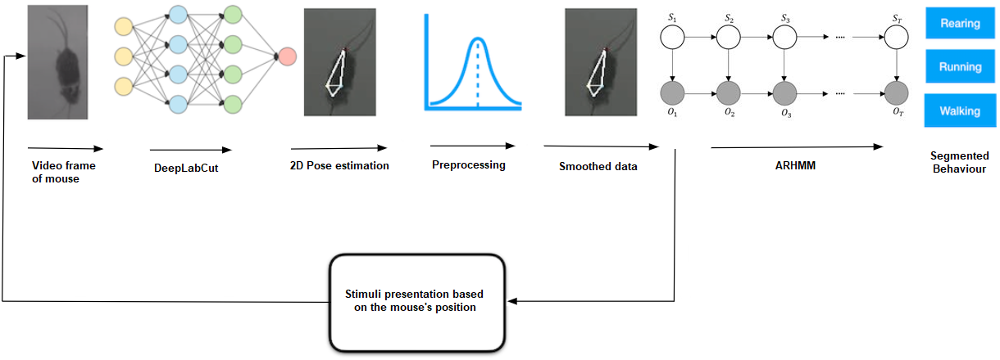
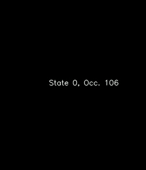
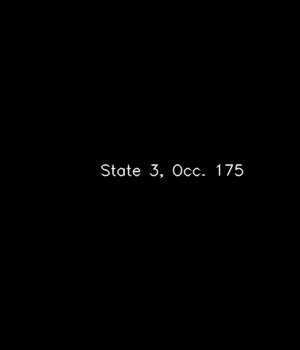
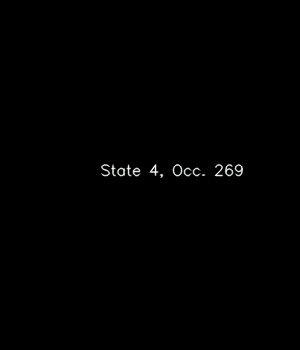
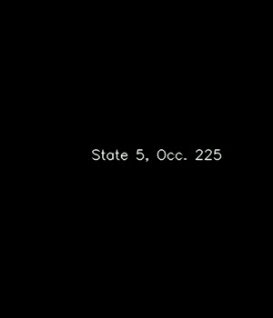
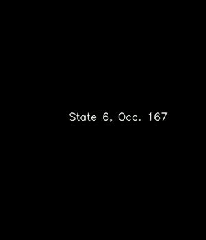
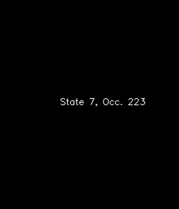
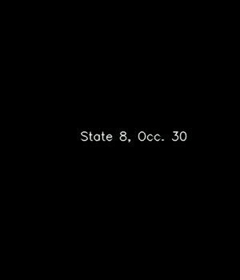

# DD2430 - Project Course in Data Science
# Segmenting behaviour of free roaming mice with Autoregressive Hidden Markov Models
## KTH Royal Institute of Technology & Kardamakis Group at Department of Neuroscience at Karolinska Institutet
### By Frans Norden, Valter Lundegårdh, Jake Kelly & Magnus Pierrau
### Supervised by Arvind Kumar (KTH), Andreas Kardamakis (KI) and with assistance from Dimitrios Mariatos

## Abstract

In this project behaviour of free roaming mice is analysed through feature tracking with a Deep Neural Network and segmentation into states with an Autoregressive Hidden Markov Model (ARHMM). We found through a time series analysis that mouse behaviour could be found on a time scale with mean duration of 200-400 ms. We therefore forced the ARHMM model, through regularisation, to find states on that time scale. This lead us to finding between nine and eleven discrete states in an 8 minute long video of a free roaming mouse. We proved the rigorousness in this through analysing the cross likelihood between states, visually inspecting the videos with assigned states  and the state trajectories in parameter space. Our results further showed promising results regarding generalisation between two different free roaming mice in a laboratory setting. 

## Methodology
The workflow to segment and classify behaviour states is illustrated in the figure below

## Digital Appendix
## Videos of learned behaviours
### Mouse 2050 data, merged ARHMM model with 9 states, kappa=2500

  
   
  

### Distinct states

  
   
  

  
   
  

  
   
  

###
## Acknowledgements
We would like to thank our fantastic supervisors Arvind and Andreas for fruitful discussions and guidance, as well as to our contact at KI and friend for life Dimitrios who worked hard to help us produce the videos, taking care of the mice, labelling hundreds and hundreds of frames, and providing interesting ideas and lively conversations! Furthermore, we would like to thank Axel Dellenby for technical support with the Arduino hardware and Espen Teigen for the software implementation of the system interrupt script and advanced technical support.
